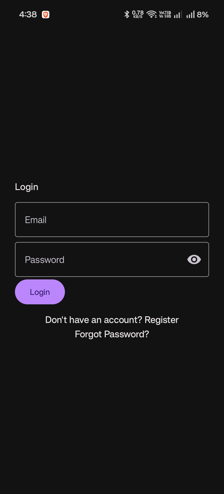
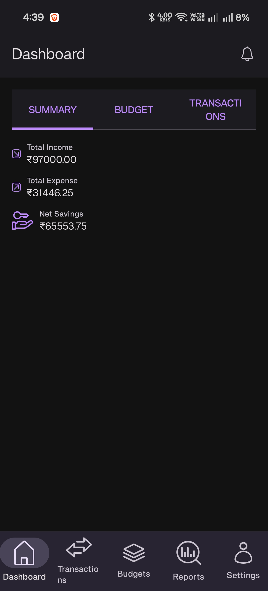
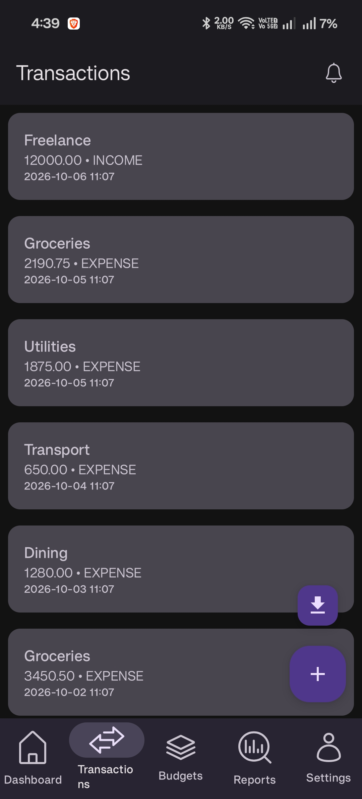
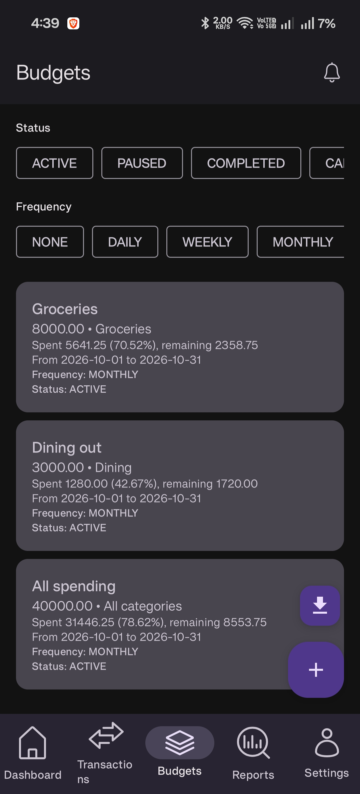
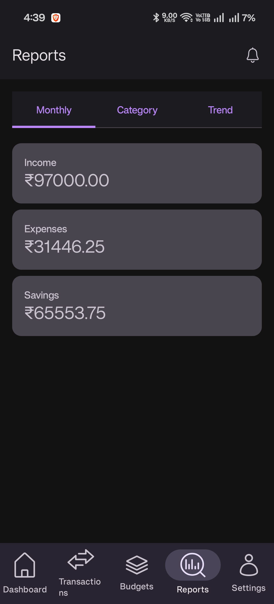
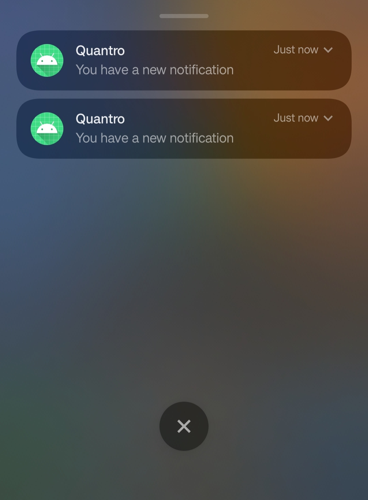

# Finance Tracker

[](https://github.com/AviK0928/Finance_Tracker_App/actions/workflows/ci.yml)

A personal finance tracker: an **Android app** (Kotlin, Jetpack Compose) backed by a **Spring Boot REST API** (Java, PostgreSQL), with push notifications through Firebase Cloud Messaging and an offline copy of your data on the phone.

The engineering log, with the bugs, root causes and decisions behind each change, is in [`engineering.md`](engineering.md).

## Screenshots

| Login | Dashboard | Transactions |
|:---:|:---:|:---:|
|  |  |  |
| **Budgets** | **Reports** | **Notifications** |
|  |  |  |

## Features

- **Accounts:** registration and login with JWT, logout (token blacklisted), forgot/reset password by email, account deletion.
- **Transactions:** create, edit, delete; filter by category (case-insensitive), type, date range and amount range; paginated list; PDF export.
- **Budgets:** per category or across all spending, with daily/weekly/monthly/yearly periods; spending is computed from the transactions; alerts at 50% and 90% of the budget and when it is exceeded, and when it is about to expire or has expired.
- **Dashboard and reports:** monthly totals, per-budget progress, category breakdown and trends.
- **Notifications:** an in-app list (read, archive) plus **push notifications** through Firebase Cloud Messaging, for example on a high-value expense. The lock screen only shows a generic text; tapping it opens the app, which refreshes its data.
- **Offline copy:** the app keeps a local Room copy of your data, kept up to date by a delta sync (`/api/sync`). Screens fall back to it with an offline banner when the server cannot be reached; pull to refresh syncs again. Writes need a connection.
- **Settings:** notification preferences, data export/import (ZIP of CSV files).
- **API documentation:** OpenAPI spec at `/v3/api-docs`, Swagger UI at `/swagger-ui.html`.

## Tech stack

| Layer | Technologies |
|---|---|
| Android app | Kotlin 2.0, Jetpack Compose, Material 3, Hilt, Retrofit/OkHttp, Room, DataStore, Navigation Compose, Firebase Cloud Messaging |
| Backend API | Java 17, Spring Boot 3.5, Spring Security (JWT), Spring Data JPA, Flyway, Firebase Admin SDK, springdoc-openapi, OpenPDF, Commons CSV |
| Database | PostgreSQL 16 (schema owned by Flyway migrations) |
| Money | `BigDecimal` / `NUMERIC(19,2)` end to end, at most 2 decimals |
| Tooling | GitHub Actions CI, GitHub Codespaces / Dev Containers, Docker Compose |

## Repository layout

```
Finance_tracker_Backend/Finance_Tracker/    Spring Boot API (Maven)
Finance_tracker_Frontend/Finance_Tracker/   Android app (Gradle)
.devcontainer/                              Codespaces / Dev Container setup
.github/workflows/ci.yml                    CI: backend tests, Android unit tests and debug build
docs/screenshots/                           Screenshots used in this README
docker-compose.yml                          Local PostgreSQL
.env.example                                Environment variable template
engineering.md                              Engineering log
```

## Quick start (GitHub Codespaces, recommended)

1. Add the Codespaces secrets you need (repository **Settings -> Secrets and variables -> Codespaces**):
   - `GOOGLE_SERVICES_JSON`: the contents of the Firebase Android config `google-services.json`. **Required for the Android build.**
   - `FIREBASE_SERVICE_ACCOUNT_JSON`: a Firebase service account key. Optional; without it the backend runs with push notifications turned off.
2. On GitHub: **Code -> Codespaces -> Create codespace on main**.
3. Wait for setup to finish (about 5 minutes the first time). The dev container:
   - provides **JDK 17**,
   - installs the **Android SDK** (platform 35, build-tools 34/35),
   - writes `app/google-services.json` from the secret,
   - creates **`.env`** from `.env.example` with a generated `JWT_SECRET`,
   - starts **PostgreSQL** with Docker Compose on every start.

### Run the backend

```bash
set -a; source .env; set +a
cd Finance_tracker_Backend/Finance_Tracker
./mvnw spring-boot:run
```

The API listens on `http://localhost:8080`. Smoke test: `curl http://localhost:8080/api/test`.

### Build the Android app

```bash
cd Finance_tracker_Frontend/Finance_Tracker
./gradlew :app:assembleDebug
```

The APK is written to `app/build/outputs/apk/debug/app-debug.apk`. To use it on a phone against the Codespace backend, add the forwarded address to `local.properties` (gitignored) before building, and make port 8080 public only while testing:

```
financeTracker.baseUrl=https://<codespace-name>-8080.app.github.dev/
```

## Local setup (without Codespaces)

Requirements: **JDK 17** (JDK 25+ is not supported by the current toolchain), Docker, and the Android SDK (platform 35) for the app.

```bash
cp .env.example .env                       # then set JWT_SECRET (openssl rand -base64 32)
docker compose up -d db                    # PostgreSQL on localhost:5432
set -a; source .env; set +a
(cd Finance_tracker_Backend/Finance_Tracker && ./mvnw spring-boot:run)
```

For the Android build, create `Finance_tracker_Frontend/Finance_Tracker/local.properties` containing `sdk.dir=/path/to/android-sdk`, and place your Firebase config at `Finance_tracker_Frontend/Finance_Tracker/app/google-services.json` (gitignored).

## Tests and CI

```bash
# Backend: unit, controller and Postgres-backed repository tests (needs the database and .env loaded)
set -a; source .env; set +a
(cd Finance_tracker_Backend/Finance_Tracker && ./mvnw test)

# Android: JVM unit tests (including Robolectric and Compose UI tests) and a debug build
(cd Finance_tracker_Frontend/Finance_Tracker && ./gradlew testDebugUnitTest assembleDebug)
```

[GitHub Actions](.github/workflows/ci.yml) runs both on every push: the backend against a PostgreSQL 16 service container, the Android job with the `GOOGLE_SERVICES_JSON` **Actions** secret (Actions secrets are separate from Codespaces secrets).

## Configuration

All secrets and environment-specific values come from environment variables (see [`.env.example`](.env.example)); none are committed.

| Variable | Required | Purpose |
|---|---|---|
| `DB_URL` | no (defaults to local Postgres) | JDBC URL |
| `DB_USERNAME` | no (defaults to `postgres`) | DB user |
| `DB_PASSWORD` | **yes** | DB password |
| `JWT_SECRET` | **yes** | Base64 HMAC key (at least 32 bytes) for signing JWTs |
| `MAIL_USERNAME` / `MAIL_PASSWORD` | no | SMTP credentials for password-reset emails |
| `FIREBASE_SERVICE_ACCOUNT_JSON` | no | Firebase service account key; empty means push notifications are off |
| `GOOGLE_SERVICES_JSON` | Android build only | Firebase Android config, written to `app/google-services.json` by the dev container and by CI |
